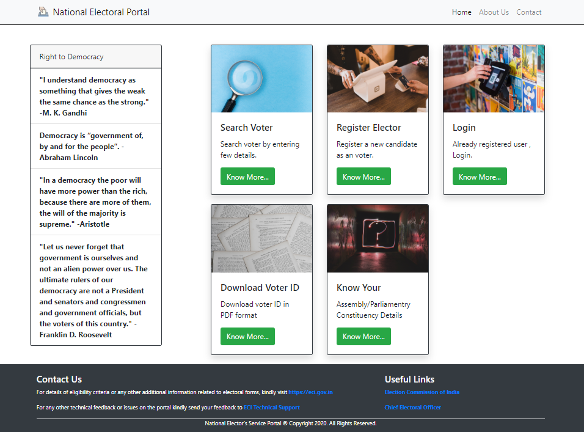
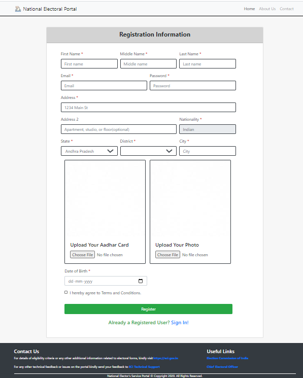
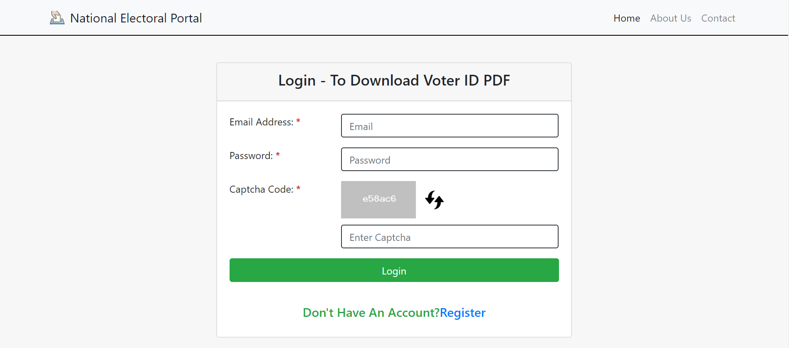
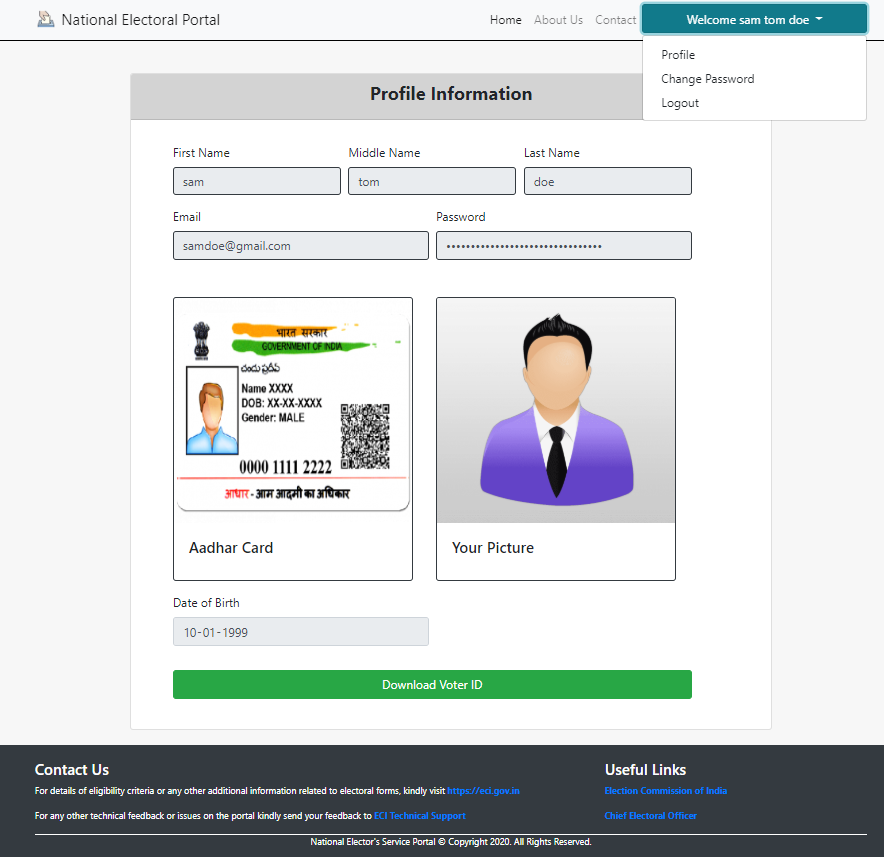

# electoralportal
A portal for voter to register , login , search in elector list and download the voter ID in PDF format . A PHP based portal having features of security via captcha login , user interactive portal. Technologies used: HTML , CSS, JavaScript, PHP , FPDF Library, BootStrap 4 , jQuery.

Screenshots of the portal are as follows:
1. Home Page:

2. Registration Page:

3.Login Page:

4.Profile Page:

5. Voter ID PDF:

